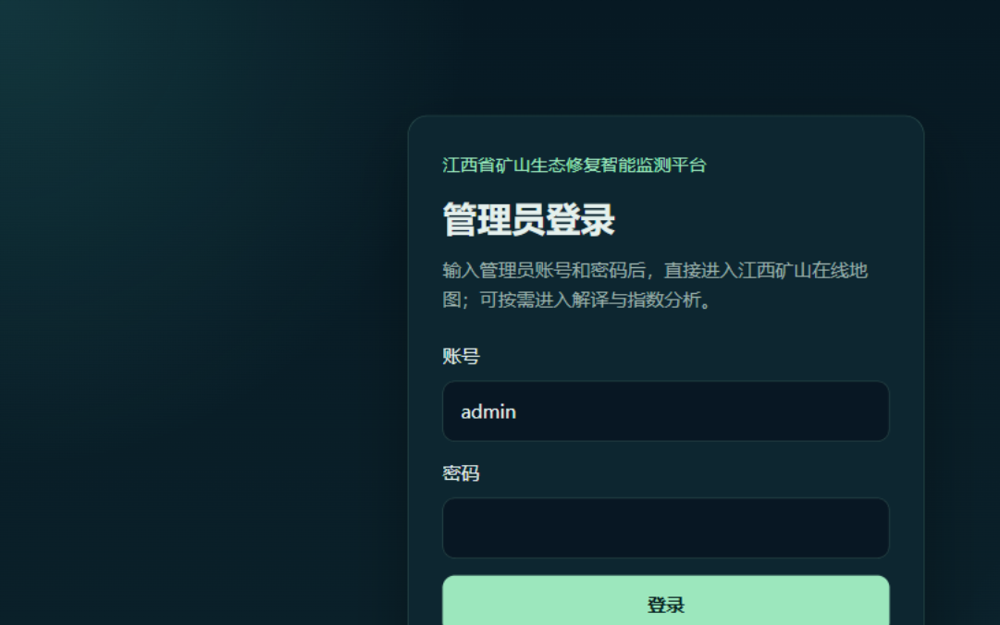
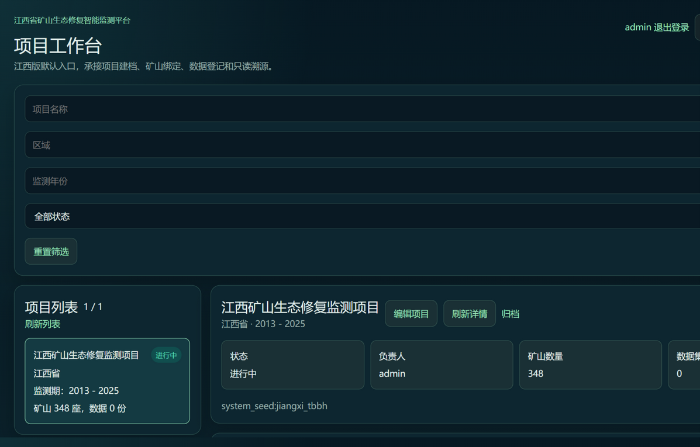
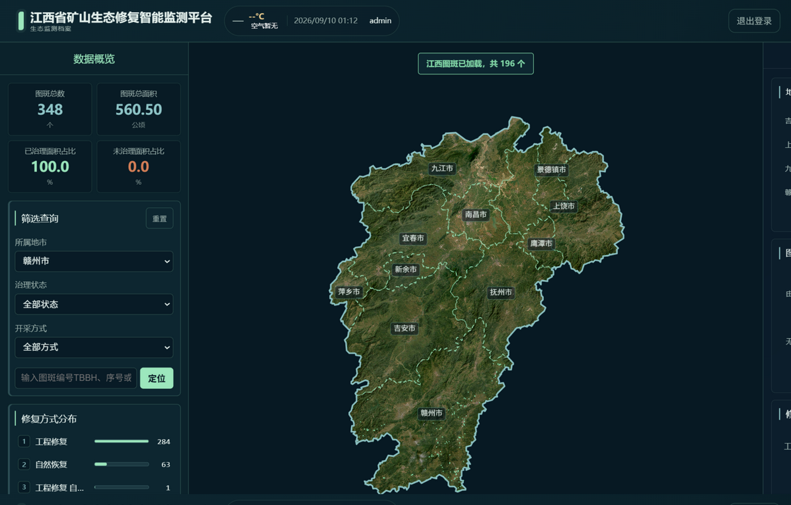
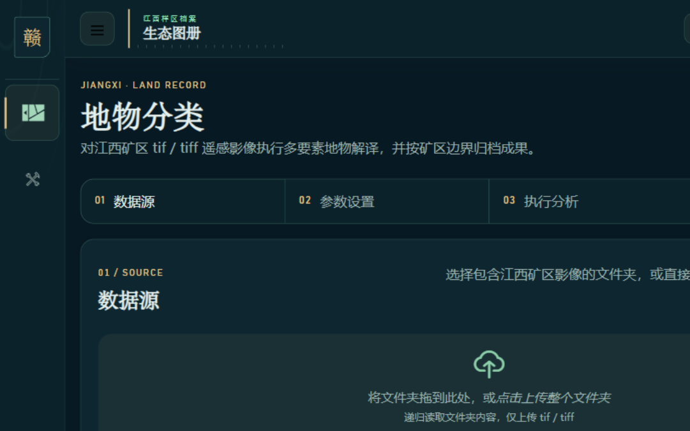
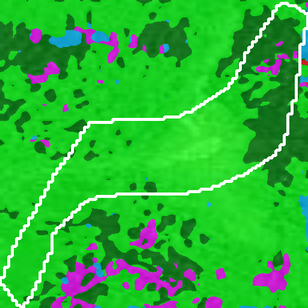
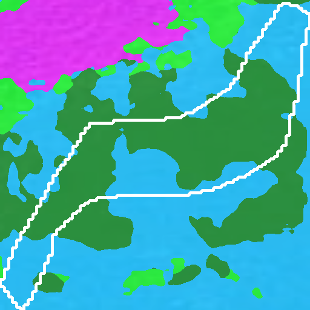

# 江西省矿山生态修复智能监测平台

面向江西省矿山的生态修复智能监测平台：以 348 个权威图斑（TBBH 主键）为档案主线，
提供离线卫星底图、图斑筛选定位、两期影像 GPU 变化解译与项目全生命周期工作台。


## 平台预览

| 管理员登录 | 项目工作台 |
| --- | --- |
|  |  |
| **筛选联动（按地市）** | **解译平台（共享会话直达）** |
|  |  |

两期影像变化解译（同一图斑 2011 → 2021，GPU 实测输出）：

| 前期影像 | 后期影像 | 分类成果 |
| --- | --- | --- |
|  |  |  |

## 核心特性

- **离线底图**：32,214 张 ESRI 卫星瓦片（z8–13）烘焙进镜像，`MINER_MAP_PROVIDER=local`
  离线运行，不依赖任何在线地图服务；底图仅渲染江西矢量边界以内，边界外以遮罩填充；
  层级钳制保证任何缩放级别都有影像（放大停在 z13 原生层级，缩小复用 z8 降采样）。
- **权威图斑档案**：Excel/SHP/KMZ 三件套共 348 条，TBBH 业务主键唯一，启动时强校验
  （manifest 哈希 + 数量 + 格式一致性，不通过拒绝启动）。
- **两期对比推理**：MMSeg 语义分割常驻 GPU worker（Unix socket），同尺寸瓦片批量前向，
  阶段计时打点；支持 C/ZJ/CT/纯数字四种 TBBH 编号格式。
- **项目工作台**：项目建档、矿山绑定、数据登记与只读溯源；列表 51,786px 内容全页可滚。
- **双前端共享会话**：Miner 地图端与解译平台通过 `jiangxi_session` 免二次登录。

## 运行架构

单一镜像 `jiangxi-gpu-*` 派生 5 个容器：`miner-web`（Vite，4173）、`miner-api`（Express，8000）、
`frontend`（Vue CLI，4174）、`backend`（Flask + MMSeg310 Conda 环境，5178）、MySQL（可选，
独立模式使用 SQLite）。推理链路：miner-web → miner-api → Flask → mmseg worker（GPU）。

## 快速开始

```bash
docker run -d --name geoview-jiangxi-gpu --gpus all \
  --env-file jx_env_gpu_20260909.env \
  -v jiangxi-runtime-data:/app/runtime_data \
  -p 127.0.0.1:4173:4000 -p 127.0.0.1:4174:3000 -p 127.0.0.1:5178:5008 \
  geoview-jiangxi:jiangxi-gpu
```

- 镜像自包含：全部前后端代码、江西专用模型权重、32,214 张离线瓦片均已烘焙，
  容器创建即完整可用。
- 唯一需要在容器创建后补放的资产：甲方两期对比影像（189 个 tif），
  `docker cp "影像目录/." 容器名:/app/backend/bianhua_2years/`。
- 环境变量模板见 `jx_env_gpu_20260909.env`（SQLite 模式、`MINER_MAP_PROVIDER=local`、
  `cuda:0` 推理）；瓦片 URL 模板由启动脚本严格校验，损坏值自动回退默认。

## 公开入口

| 入口 | 地址 |
| --- | --- |
| Miner 地图 | `http://127.0.0.1:4173/#/map` |
| 江西解译平台 | `http://127.0.0.1:4174/#/segmentation` |
| 业务后端 | `http://127.0.0.1:5178` |

宿主机端口只绑定 `127.0.0.1`。Miner API 与 MySQL 仅在江西 Docker 网络内提供服务，不发布宿主机端口。江西应用镜像、容器和命名卷使用 `jiangxi-*` 命名空间；云南工程及其容器、镜像、数据卷、数据库和运行数据保持不变。

两个江西前端连接同一业务后端，并通过 `jiangxi_session` 共享登录会话。江西解译固定使用同步 CPU，不提供 GPU 覆盖、自动设备选择或异常回退。地物分类必须配置江西专用模型，禁止回退到云南模型。

## 测试与验证

提交前必须通过四道验证门（详见 AGENTS.md §5，后端单测必须在容器内 MMSeg310
环境运行，宿主机解释器漂移会产生假失败）：

```bash
# ① 后端单测（容器内权威环境）
docker exec <容器> bash -c 'source /opt/conda/etc/profile.d/conda.sh && conda activate MMSeg310 && cd /app && python -m unittest discover -s backend -p "test*.py"'
# ② 权威资产校验（348 条三件套一致性）
docker exec <容器> bash -c 'source /opt/conda/etc/profile.d/conda.sh && conda activate MMSeg310 && python /app/backend/tools/validate_jiangxi_assets.py'
# ③ miner 端门（prettier + eslint + 单测 + vite 构建）
cd miner && npm run verify
# ④ 解译前端构建
cd frontend && npm run build
```

动态行为按 §5.1 三级递进验证：重复执行 → 混合批次（≥3 组不同形态输入）→ 全量回归。
技巧与失效案例见[测试方法手册](docs/testing_playbook.md)。

## 文档

- [部署指南](docs/offline_deployment_guide.md)
- [系统与隔离边界](docs/system_guide.md)
- [用户手册](docs/user_manual.md)
- [管理员登录](docs/admin_login.md)
- [重启与排障](docs/docker_restart_guide.md)
- [江西成果迁移规则](docs/legacy_data_migration.md)
- [交付检查清单](docs/delivery_checklist.md)
- [测试方法手册](docs/testing_playbook.md)
