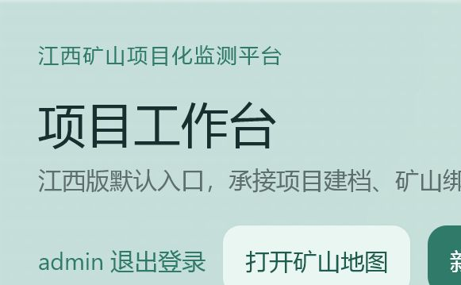

# 江西矿山项目化监测平台使用说明

适用范围：单管理员、内网部署的江西矿山遥感分析与项目管理系统。

## 1. 启动前准备

1. 从项目根目录复制 `.env.example` 为未跟踪的 `.env`。
2. 设置 `ADMIN_PASSWORD`、`SECRET_KEY`、`MYSQL_PASSWORD` 和 `MYSQL_ROOT_PASSWORD`；不要使用示例值。
3. 将 `Mine.csv`、Shapefile 全部配套文件（`.shp/.shx/.dbf/.prj`）和 `Jiangxi_NaturalMine.kmz` 放入 `docker/standalone/runtime_data`。
4. 启动 Compose 服务，或构建并运行独立 SQLite 镜像。详细命令见 [offline_deployment_guide.md](offline_deployment_guide.md)。

### Compose 启动

离线环境先加载镜像；当前交付镜像加载后使用 `geoview-runtime:split-clean` 标签：

```powershell
docker load -i offline_bundle/images/geoview_runtime_current.tar
docker load -i offline_bundle/images/mysql_8.0.30-8.6.tar
Copy-Item .env.example .env
# 编辑 .env，替换所有密码占位符。
$env:APP_IMAGE = 'geoview-runtime:split-clean'
docker compose -f docker-compose.prod.yml up -d
docker compose -f docker-compose.prod.yml ps
```

首次启动后检查 `3000`、`4000`、`5008` 和 `8000` 端口对应服务是否为 `running` 或 `healthy`。停止服务使用 `docker compose -f docker-compose.prod.yml down`；该命令不带 `-v`，不会删除数据库卷。

独立镜像示例：

```bash
docker build -f docker/standalone/Dockerfile.jiangxi -t geoview-jiangxi:standalone .
docker run -d --name geoview-jiangxi --env-file .env -p 4000:4000 -p 5008:5008 geoview-jiangxi:standalone
```

启动后访问 `http://服务器地址:4000`。管理 API 位于 `5008` 端口；不应对公网开放数据库端口。

### 图斑修复诊断工作簿

点击矿山图斑后，弹窗会使用 `348图斑_TableMERNet无图像预测结果.xlsx` 展示 NDVI 及生态、环境和模型诊断资料。地图图斑与工作簿以 `TBBH` 精确关联；`FID` 和 `序号` 仅保留用于审计，绝不作为诊断资料的匹配依据。图斑缺少 `TBBH` 时会明确提示无法关联，避免展示错误矿山的数据。独立镜像已内置该文件；Compose 运行时从 `miner/data/` 只读挂载。

需更新数据时，在停止 Compose 服务后使用新工作簿替换 `miner/data/348图斑_TableMERNet无图像预测结果.xlsx`，再重新启动 `miner-api`。如使用独立镜像，替换文件后需重建镜像；也可将工作簿只读挂载到 `/app/miner/data/` 并在 `.env` 中设置 `MINER_ECOLOGY_WORKBOOK_PATH` 为容器内文件路径。

弹窗中的模型修复类型、概率、置信度和复核建议均为 **AI 辅助研判**，不替代台账中的正式治理状态与修复方式。

弹窗默认进入“修复诊断”：首屏显示台账状态、修复方式、AI 辅助研判和 NDVI、植被覆盖度、叶面积指数、净初级生产力的最新值及首末变化。每个指标均为独立页签：`NDVI`、`FCV`、`LAI`、`NPP`、`LST`、`土壤湿度`、`TVDI` 分别展示 2013–2025 年折线和原始年度值；趋势图默认每 2 年采样，可切换为逐年显示，采样不会删除原始数据。其中土壤湿度与 TVDI 明确标注为代理指标。仅“气候背景”将年均温折线与年降水柱状图合并为双轴图。云南历史项目的 `NDBI`、`NDWI`、`NDSI`，以及未交付任何图斑结果的变化矩阵和地物分类，均不在江西弹窗中显示。“模型研判”展示完整概率、阈值和复核建议；“基础资料”可展开查看项目、治理和填报台账字段。缺失年份会明确标识，不会插值。

## 2. 管理员登录

在登录页输入 `.env` 中配置的管理员账号和密码，点击“登录”。默认账号名为 `admin`，可通过 `ADMIN_USERNAME` 覆盖。


图 1：管理员登录页。密码仅在登录请求中使用，不会显示在界面或导出文件中。

## 3. 项目工作台

登录后默认进入“项目工作台”。左侧用于筛选和选择项目；右侧显示项目状态、负责人、绑定矿山、数据集、时间线、导出及备份记录。江西默认项目以 348 个地图图斑为统计与绑定口径，监测期为 2013–2025；旧 `Mine.csv` 的 284 个主体汇总仅保留为历史原始资料，不再决定项目矿山数量。



图 2：江西默认项目工作台。首次独立部署完成种子导入后，会显示江西矿山主体和绑定图斑。

### 新建与维护项目

1. 点击“新建项目”，填写项目名称、区域和监测期。
2. 在项目详情中编辑负责人、备注和状态。
3. 在“江西主体矿山”中勾选或取消勾选主体矿山；系统会同步维护对应图斑绑定。
4. 使用“归档”结束项目；需要继续维护时再恢复为进行中状态。

### 登记数据集

在“项目数据集”区域填写显示名称、数据类型、服务端文件路径和源格式，再选择关联矿山（可留空表示项目级数据）并提交。

文件必须先由运维人员放入服务端受控数据目录。浏览器不得提交任意本机绝对路径。

## 4. 导出与备份

- “导出 GeoJSON / CSV / SHP”会按当前项目绑定矿山生成交付文件。
- “生成备份”保存项目元数据、矿山绑定、数据集与导出索引；在备份记录中执行恢复可回滚项目状态。
- 导出和备份目录由服务端固定管理。系统不支持自定义 `output_dir`，以避免任意目录写入。

建议在项目阶段结束、批量调整绑定关系之前分别创建备份。

## 5. 矿山地图与 ROI 推理

点击页面顶部“打开矿山地图”进入地图功能。地图仅加载江西省范围的卫星影像，固定显示江西省轮廓、11 个地市边界和矿山图斑；缩放与拖动范围限制在江西业务区域内。点击图斑可定位矿山并进入变化分析流程。

KML ROI 推理使用受控数据根目录中的 TIF 与 KML/KMZ 文件：

- FID 必须为正整数；KML 中非法 FID 会被拒绝。
- 页面/API 仅接受文件名，不接受绝对路径、`..` 或符号链接逃逸路径。
- 推理结果固定写入服务端 ROI 输出目录，并按 FID 分目录保存。

完成推理后，可在 ROI 历史记录中查看或删除结果。删除与清理操作只影响受控输出目录内的文件。

## 6. 常见问题

| 现象 | 处理方式 |
| --- | --- |
| 容器启动即退出并提示缺少环境变量 | 检查 `.env` 是否传入 `ADMIN_PASSWORD`、`SECRET_KEY` 及数据库密码。 |
| 登录后没有江西项目 | 检查 `Mine.csv` 是否存在、首启种子日志是否成功，以及运行数据目录挂载。 |
| 图斑或 KML 未加载 | 检查 Shapefile 配套文件和 KMZ 是否都位于容器内 `/app/runtime_data`。 |
| ROI 推理返回 400 | 确认 TIF/KML 是受控目录内的文件名，FID 为正整数，且没有使用客户端绝对路径。 |
| 无法恢复备份 | 确认备份记录由当前项目生成，且对应 JSON 清单仍在服务端受控备份目录中。 |

## 7. 运维边界

- 这是内网单管理员系统，不提供多用户、角色权限或云存储。
- `.env`、运行数据、日志、导出文件和推理结果均不应提交到版本控制。
- 生产部署完成后，至少验证登录、江西图斑加载、一次项目导出、一次备份恢复和一次 KML ROI 推理。
